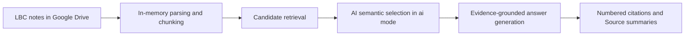

# Brind Mentor User Guide

> 心安之处是成熙！

Brind Mentor is a private, lightweight RAG assistant built from previous LBC notes. The project began during cohort 38C. Its knowledge base currently focuses on 38C material and can be expanded with notes from future classes.

Thank you to everyone who helped collect, organize, and maintain the LBC notes.

The application retrieves relevant material from the knowledge base and turns it into a structured, mentor-style explanation of conclusions, mechanisms, constraints, and risks. It is not Brind, and it does not replace the original course, source notes, or professional advice.

## Current Knowledge Coverage

The knowledge base currently includes:

- **LBC38** — curated notes and group chat history. This collection is actively maintained and continues to receive updates.
- **LBC37** — group chat notes and discussion records.

Coverage will continue to grow as additional approved material is added to the connected Google Drive knowledge base.

## How the RAG Pipeline Works



| RAG component | Implementation |
| --- | --- |
| **Knowledge base** | LBC notes and approved chat exports stored in Google Drive. |
| **Indexing** | Files are parsed and split into temporary text chunks when the service starts or refreshes. |
| **Retrieval** | Text matching narrows the candidate set; `ai` mode adds semantic selection. |
| **Augmentation** | Selected chunks are supplied to the answer model as evidence. |
| **Generation** | The model combines the question, answer mode, and retrieved evidence. |
| **Grounding** | Citations such as `[1]` and `[2]` connect claims to short Source summaries. |

This is a privacy-oriented, lightweight RAG architecture:

- Private notes are not committed to GitHub.
- Source documents are not persisted to the application directory.
- The project does not maintain a long-lived vector database or knowledge snapshot.
- The index exists only in process memory and is rebuilt after a service restart.

The current implementation does not require a traditional embedding database. `fast` mode uses lightweight text retrieval. `ai` mode adds a semantic judging step before answer generation.

## Quick Start

1. Open [Brind Mentor](https://mentorbrind-ai.onrender.com).
2. If prompted, enter the access code and select **Unlock**.
3. Check the sidebar:
   - **Health: Ready** means the service is available.
   - **Knowledge Index: Cached** means the knowledge base is ready.
   - If the index shows `Building`, wait for it to finish before asking a question.
4. Choose an **Answer Mode**.
5. Enter a question at the bottom of the page and select **Send**.

The first startup or a full knowledge-base refresh may take additional time.

## What You Can Ask

Good questions include:

- The industry logic, competition, and risks behind a company or market theme.
- How to break down a psychological pattern or relationship difficulty.
- The mechanisms behind AI, business, education, or social trends.
- How an LBC concept applies to a real-world problem.
- A challenge to an assumption, including counterexamples and boundary conditions.

Examples:

```text
Using the notes, separate the narrative from the fundamentals behind a robotics market rally.
```

```text
Why do people repeatedly seek reassurance in close relationships? Explain it for a beginner.
```

```text
Challenge the claim that AI will replace most white-collar work.
```

## How to Get Better Answers

Retrieval is usually more accurate when the question includes:

- **Subject** — what you want to analyze.
- **Angle** — mechanism, risk, valuation, psychology, or action.
- **Scope** — short or long term, individual or industry, notes only or cautious extension.
- **Output** — conclusion, layered explanation, opposing view, or strict citations.

A useful structure is:

```text
Subject + the judgment you need to make + the analysis style you want
```

Avoid single broad terms such as “stocks” or “relationships.”

## Answer Modes

| Mode | Best for | Behavior |
| --- | --- | --- |
| `mentor` | Everyday analysis | Starts with a conclusion, then explains mechanisms, constraints, and risks. |
| `strict citation` | Verifying note support | Cites important claims and says when the notes do not support a conclusion. |
| `beginner explanation` | New topics | Uses less jargon, layered explanations, and simple analogies when helpful. |
| `challenge assumptions` | Stress-testing a claim | Identifies hidden assumptions, counterexamples, boundary conditions, and a final judgment. |

Use `mentor` when you are unsure which mode to choose.

## How to Read an Answer

### Answer text

The answer should prioritize retrieved note logic. When note coverage is incomplete, the model may make a cautious extension and should distinguish that analysis from direct note support.

Citation numbers such as `[1]` and `[2]` correspond to the Source cards below the answer.

### Sources

Each Source card:

- corresponds to the same citation number in the answer;
- summarizes the evidence supporting the cited claim;
- displays at most 100 characters by default; and
- hides private Google Drive paths and file identifiers.

A Source is a short verification aid, not the complete original note. Consult the original material when full context matters.

### AI topic and note coverage

- **AI topic** summarizes the interpreted subject of the question.
- **confidence** describes confidence in the retrieval judgment.
- **note coverage** indicates how strongly the knowledge base covers the question: `high`, `medium`, or `low`.

High coverage means retrieval overlap is strong; it does not guarantee that the answer is correct.

## Sidebar Reference

### System

| Status | Meaning |
| --- | --- |
| **App: Unlocked / Open** | Access control has been passed or is disabled. |
| **Google: Connected** | The configured Google Drive knowledge base is available. |
| **OAuth: Available** | Administrator Google sign-in is available as a backup connection method. |
| **OpenAI: Configured** | AI retrieval and answer generation are configured. |
| **Local Data: No** | Source knowledge files are not written to the application directory. |
| **Health: Ready** | Required services are configured and available. |

### Knowledge Index

| Field | Meaning |
| --- | --- |
| **Status** | `Cached` is ready, `Building` is updating, and `Empty` has no index. |
| **Refresh In** | Time until the next automatic knowledge-base check. |
| **Files** | Number of files scanned for the current index. |
| **Chunks** | Number of text chunks created from the files. |
| **Skipped** | Files that could not be read or parsed. |
| **Last refresh** | Counts for read, reused, changed, removed, and skipped files. |

## Updating the Knowledge Base

After adding or modifying files in Google Drive:

1. Select **Refresh** in the **Knowledge Index** panel.
2. Wait while the status shows `Building`.
3. Continue when the status returns to `Cached`.
4. Review **Last refresh** for changed, removed, or skipped files.

Refreshing runs in the background. Wait for it to finish before asking about newly added material.

## When a Source Looks Unrelated

Possible causes include:

- The question is too broad.
- Several topics use the same vocabulary.
- The notes have weak direct coverage.
- `Fast retrieval mode` is enabled.
- The Source is a short summary while the complete context remains in the original note.

Try the following:

1. Add a specific subject, time frame, and judgment angle.
2. Ask again using `strict citation` mode.
3. Refresh the index.
4. If the interface shows `Fast retrieval mode`, ask the administrator to enable semantic retrieval.

## Privacy and Data Boundaries

- Google Drive material is read into the service's in-memory index.
- Original notes, extracted text, and knowledge snapshots are not committed to GitHub.
- The interface exposes only selected short Source summaries, not Drive IDs or paths.
- The access code is lightweight protection, not a full enterprise identity system.
- Do not enter passwords, API keys, identity documents, or unnecessary personal information.

## Responsible Use

Brind Mentor is a learning and analysis assistant:

- Financial content is not investment advice.
- Medical content is not a diagnosis, prescription, or medication instruction.
- Psychological and relationship content does not replace professional or emergency support.
- AI may misunderstand notes, miss context, or generate an incorrect conclusion.

For decisions involving money, health, safety, or legal consequences, consult reliable primary sources and qualified professionals.

## Frequently Asked Questions

### The page shows Locked

Enter the administrator-provided access code and select **Unlock**.

### Health shows Setup needed

Google Drive, OpenAI, or another required setting is incomplete. Send the sidebar status to the administrator.

### Knowledge Index remains Building

Large PDF and DOCX files can take longer to process. If the status does not change, reload the page and ask the administrator to inspect the service logs.

### Answers are slow

Initial indexing, semantic retrieval, and long questions increase latency. Ask one focused question at a time.

### An answer contains a claim that is not in the notes

Use `strict citation`, narrow the question, and inspect the corresponding Sources. Verify important conclusions against the original notes.

### A new note does not appear in answers

Select **Refresh**, wait for `Cached`, and ask again.

### Does the system remember previous messages?

The current version retrieves mainly from each individual question. Include necessary context in follow-up questions.

## Supported Knowledge Files

- Google Docs
- TXT and Markdown
- PDF
- DOCX
- RTF
- Legacy `.doc` files on a best-effort basis; conversion to DOCX or Google Docs is recommended

Scanned PDFs, images, and handwriting are not currently processed with OCR.

## Group Chat History

TXT chat exports placed in the Google Drive `chat history` folder use a dedicated mentor-first indexing pipeline:

- Only messages from configured mentor aliases become mentor evidence.
- Up to two preceding member messages may be retained as context only.
- Other members' messages cannot be cited as mentor opinions.
- Media placeholders, short acknowledgements, casual replies, and quoted reposts are filtered out.
- Additional mentor aliases can be configured with `MENTOR_CHAT_ALIASES`.

Curated notes remain the primary knowledge source. By default, retrieval reserves 20 of 30 candidate positions for documents and 10 for chat. When relevant documents are available, the final model may use at most three chat sources. If curated notes and chat conflict, curated notes take priority.

After uploading or replacing a chat export, select **Refresh** and wait for `Cached`.

## Private Term Configuration

Private term-equivalence groups can be configured through the `CODED_TERM_GROUPS_JSON` environment variable. Actual mappings should remain deployment secrets and must not be written to source code, documentation, tests, commits, or pull requests.

Generic format:

```json
{"canonical term":["private alias 1","private alias 2"]}
```

## Maintainer Appendix

Regular users do not need this section.

### Local preview

Python 3.11 or newer is required.

```powershell
Copy-Item .env.example .env
powershell -ExecutionPolicy Bypass -File .\scripts\preview.ps1
```

Open `http://localhost:4173`.

### Main configuration

See `.env.example` for the complete template and `render.yaml` for the lightweight deployment template.

| Variable | Purpose |
| --- | --- |
| `AI_RETRIEVAL_MODE` | `ai` enables semantic selection; `fast` reduces latency with weaker relevance. |
| `SOURCE_EXCERPT_CHARS` | Maximum Source summary length; default 100. |
| `DRIVE_INDEX_TTL_SECONDS` | Interval between automatic knowledge-base checks. |
| `OPENAI_MODEL` | Model used for retrieval judgment and answer generation. |
| `MENTOR_CHAT_ALIASES` | Comma-separated mentor names recognized in chat exports. |
| `CHAT_CONTEXT_MESSAGES` | Number of preceding member messages kept as context; default 2. |
| `CHAT_MENTOR_CHUNK_CHARS` | Target size for grouped mentor chat chunks; default 1600. |
| `CHAT_MIN_MENTOR_CHUNK_CHARS` | Minimum meaningful size for mentor chat chunks; default 12. |
| `MAX_CHAT_CANDIDATES_FOR_AI` | Chat positions in the semantic candidate pool; default 10. |
| `MAX_CHAT_SOURCES_FOR_MODEL` | Maximum chat sources when relevant documents exist; default 3. |
| `CODED_TERM_GROUPS_JSON` | Private canonical-term and alias groups supplied at deployment. |

### Security requirements

Never commit:

- `.env`;
- Google service-account JSON;
- OAuth tokens or OpenAI API keys;
- downloaded Drive files;
- private term mappings;
- extracted note text, knowledge snapshots, or logs and screenshots containing private material.
